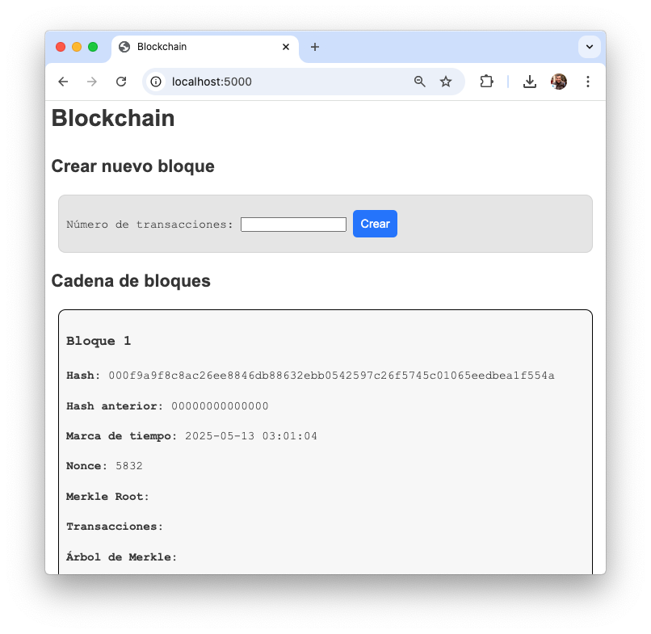
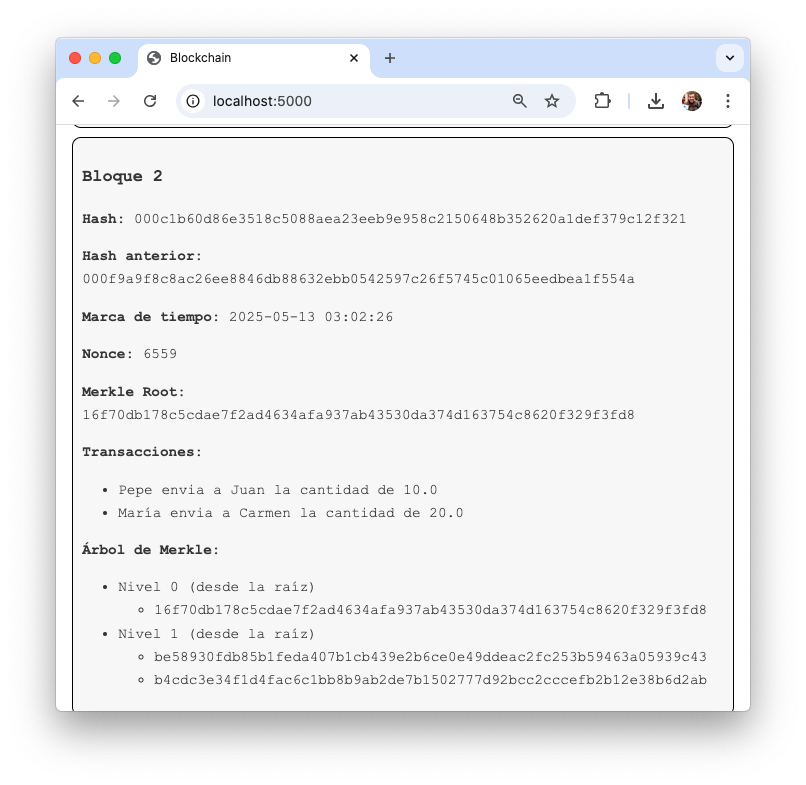

# Introducción a Blockchain

Este repositorio contiene los ejemplos utilizados en el seminario de Blockchain
de la asignatura de [Negocio Electrónico][1].

## Índice de contenidos

- [1. ¿Qué es una Blockchain?](#1-qué-es-una-blockchain)
- [2. Tipos de Blockchain](#2-tipos-de-blockchain)
- [3. Bloque](#3-bloque)
- [4. Transacciones](#4-transacciones)
- [5. Árbol de Merkle](#5-árbol-de-merkle)   
- [6. Mecanismos de Consenso](#6-mecanismos-de-consenso)
- [7. Simuladores de Blockchain](#7-simuladores-de-blockchain)
- [8. Vídeos](#8-vídeos)
- [9. Referencias](#9-referencias)
- [10. Ejemplos](#10-ejemplos)
- [11. Créditos](#11-créditos)

## 1. ¿Qué es una Blockchain?

Una blockchain o cadena de bloques, es un sistema de registro distribuido
(_distributed ledger_) y descentralizado, que está mantenido por una red de
nodos independientes, que almacena información (como transacciones, smart
contracts, etc.) en bloques enlazados criptográficamente.

Estos bloques son prácticamente inalterables gracias a su diseño: cada uno
contiene un hash único de sus datos y el hash del bloque anterior, formando una
cadena.  

Algunas de sus principales características son:

- **Inmutabilidad**: Los datos no pueden modificarse sin consenso de la red.  
- **Transparencia**: Todos los participantes pueden verificar los registros.  
- **Seguridad**: Garantizada por criptografía y mecanismos de consenso (como
  _Proof of Work_ o _Proof of Stake_).
- **Descentralización**: La red se gestiona de forma distribuida entre nodos
  independientes, sin depender de una autoridad única"
- **Trazabilidad:** Todos los cambios quedan registrados en la cadena, lo que
  permite rastrear el historial de los datos que se almacenan.
- **Anonimato:** En las blockchains púbicas, los usuarios utilizan
  identificadores que no revelan su nombre real.

Este sistema permite que entidades sin confianza mutua alcancen consenso sobre
la validez y el estado de los datos compartidos, eliminando la necesidad de
intermediarios.  

## 2. Tipos de Blockchain

Existen varios tipos de blockchains:

- **Blockchain Pública:** Cualquiera puede unirse y participar en la red.
  _Ejemplo_: Bitcoin, Ethereum.
- **Blockchain Privada:** Controladas por una única entidad o un grupo limitado
  de participantes. _Ejemplo_: Hyperledger de IBM.
- **Blockchain Híbrida:** Combinan características de blockchains públicas y
  privadas.
- **Blockchain de Consorcio:** Controladas por un grupo de
  organizaciones. _Ejemplo_: R3 Corda.

## 3. Bloque

Un bloque es la unidad básica de estructura de una blockchain. Funciona como un
eslabón de la cadena que almacena datos y se conecta criptográficamente con los
bloques anteriores y posteriores, formando una cadena inmutable.


Imagen 1: Blockchain y estructura de un bloque. Imagen obtenida de [ResearchGate](https://www.researchgate.net/figure/Blockchain-and-block-structure_fig1_351730117).

En la blockchain que vamos a utilizar en este seminario, se ha diseñado un
bloque básico que contiene los siguientes datos:

- **Hash del bloque:** Identificador único del bloque, generado a partir de su
  contenido. Se calcula mediante consenso.
- **Hash del bloque anterior:** Identificador único del bloque anterior,
  asegurando la integridad de la cadena.
- **Marca de tiempo:** Fecha y hora en que se creó el bloque.
- **Lista de transacciones:** Lista de transacciones incluidas en el bloque.
- **Árbol de Merkle:** Estructura de árbol que organiza las transacciones en
  pares cifrados. Nos permite verificar de forma sencilla si una transacción
  está incluida en el bloque.
- **Merkle Root:** Hash de la raíz del árbol de Merkle.
- **Nonce:** Número aleatorio utilizado en el proceso de minería (_Proof of
  Work_) para encontrar un hash válido.

**Ejemplo:**

A continuación, se muestra un ejemplo en Python del constructor de la clase
`Bloque` que se ha utilizado en la blockchain de este seminario.

```python
class Bloque:
    def __init__(self, hash_anterior: str, l_transacciones: List[Transaccion], marca_de_tiempo: str):
        self.hash_anterior = hash_anterior
        self.marca_de_tiempo = marca_de_tiempo
        self.l_transacciones = l_transacciones
        self.merkle_tree = MerkleTree(l_transacciones)
        self.merkle_root = self.merkle_tree.root
        self.merkle_niveles = self.merkle_tree.niveles
        self.nonce = 0
        self.hash = self.proof_of_work()
```

## 4. Transacciones

En la blockchain que vamos a utilizar en este seminario, se ha diseñado una
transacción básica que contiene los siguientes datos:

- **Pagador:** Identificador del usuario que envía la transacción.
- **Receptor:** Identificador del usuario que recibe la transacción.
- **Cantidad:** Cantidad de dinero transferido.

**Ejemplo:**

A continuación, se muestra un ejemplo en Python del constructor de la clase
`Transaccion` que se ha utilizado en la blockchain de este seminario.

```python
class Transaccion:
    def __init__(self, pagador: str, receptor: str, cantidad: float):
        self.pagador = pagador
        self.receptor = receptor
        self.cantidad = cantidad
```

## 5. Árbol de Merkle


Imagen 2: Árbol de Merkle. Imagen obtenida de [Wikipedia](https://es.wikipedia.org/wiki/%C3%81rbol_de_Merkle#/media/Archivo:Hash_Tree.svg).

Un árbol de Merkle es una estructura de datos en árbol en el que cada nodo que
no es una hoja está etiquetado con el hash que resulta de concatenar los hashes
de sus nodos hijo.

El árbol de Merkle proporciona un método de verificación segura y eficiente para
grandes estructuras de datos. Para poder verificar que una transacción está
incluida en un nodo hoja, sólo es necesario conocer una cantidad de datos
proporcional al logaritmo en base 2 del número de nodos hoja del árbol. Ejemplo:
Si el árbol tiene 1024 nodos hoja (transacciones), sólo es necesario conocer 10
hashes para verificar que una transacción está incluida en el árbol.

**Ejemplo:**


Imagen 3: Árbol de Merkle. Imagen obtenida de [Medium](https://medium.com/crypto-0-nite/merkle-proofs-explained-6dd429623dc5).

En este ejemplo para verificar que la transacción H(K) está incluida en el árbol sólo serían necesarios los hashes:

- H(L)
- H(IJ)
- H(MNOP)
- H(ABCDEFGH)

En este ejemplo tenemos 16 nodos hojas (transacciones), por lo tanto, el número
de hashes que necesitamos para verificar que la transacción H(K) está incluida
en el árbol es: log2(16) = 4.

_Referencias:_

- [Árbol de Merkle](https://es.wikipedia.org/wiki/%C3%81rbol_de_Merkle). Wikipedia.
- [Merkle proofs explained](https://medium.com/crypto-0-nite/merkle-proofs-explained-6dd429623dc5). Medium.

**Ejemplo:**

A continuación, se muestra un ejemplo en Python del constructor de la clase
`MerkleTree` que se ha utilizado en la blockchain de este seminario.

```python
class MerkleTree: 
    def __init__(self, l_transacciones: List[Transaccion]):
        self.l_transacciones = l_transacciones
        self.root, self.niveles = self.construir_merkle_tree()

```

## 6. Mecanismos de Consenso

Los mecanismos de consenso permiten validar las transacciones y asegurar la red.
Algunos ejemplos de mecanismos de consenso son:

- **_Proof-of-Work_ (PoW):** Los mineros compiten para resolver problemas
  criptográficos complejos. El primer minero en encontrar la solución puede
  añadir un nuevo bloque a la cadena. Ejemplo: Bitcoin.

- **_Proof-of-Stake_ (PoS):**  Los validadores son seleccionados (a menudo de
  forma probabilística, con mayor probabilidad para aquellos que han apostado
  una mayor cantidad de criptomonedas) para proponer y validar nuevos bloques.
  La capacidad de validar está ligada a la cantidad de criptomonedas que poseen
  y están dispuestos a "apostar" o bloquear como garantía. Ejemplo: Ethereum.

## 7. Simuladores de Blockchain

Los siguientes simuladores le ayudarán a entender mejor el funcionamiento de una
blockchain.

- [Blockchain Demo](https://andersbrownworth.com/blockchain/). Anders Brownworth.
- [Simulador de Blockchain](https://blockchain-sim-test.web.app). J. Cáceres, J.Guerrero y G. Lemus.
- [blockchaindemo.io](https://blockchaindemo.io)

## 8. Vídeos

- [Introducción a las tecnologías Blockchain. Parte I](https://canal.uned.es/video/646488c86ff5a73b9e6a73c2). Víctor García Pastor. UNED.
- [Introducción a las tecnologías Blockchain. Parte II](https://canal.uned.es/video/646488c86ff5a73b9e6a73c7). Víctor García Pastor. UNED.

## 9. Referencias

- [¿Qué es el Blockchain?](https://www.ibm.com/es-es/topics/blockchain). IBM.
- [Blockchain: La revolución industrial en Internet](https://libroblockchain.com/). Alex Preukschat. Gestión 2000.
- [Bitcoin: Un Sistema de Efectivo Electrónico Usuario-a-Usuario](https://bitcoin.org/files/bitcoin-paper/bitcoin_es_latam.pdf). Satoshi Nakamoto.
- [Blockchain Structure](https://www.geeksforgeeks.org/blockchain-structure/). GeeksforGeeks.
- [Seminario Flask](https://github.com/josejuansanchez/seminario-flask).

## 10. Ejemplos

- [Blockchain en Google Colab](notebook/blockchain.ipynb): Ejemplo de una
  blockchain básica implementada en Python en un notebook de Google Colab.
- [Blockchain en Flask](flask/): Ejemplo de una blockchain básica implementada
  en Python y Flask.


Imagen 4. Página con el bloque génesis de la blockchain.


Imagen 5. Formulario para añadir transacciones a un bloque.


Imagen 6. Página con la blockchain actualizada con el nuevo bloque.

## 11. Créditos

El código utilizado en este seminario está basado en el código desarrollado por
[José Antonio Torres Ariaza](https://www.ual.es/persona/535053495455545772).
Sólo se han modificado pequeños detalles para crear el proyecto en
Flask.

[1]: https://www.ual.es/estudios/grados/presentacion/plandeestudios/asignatura/4015/40153316